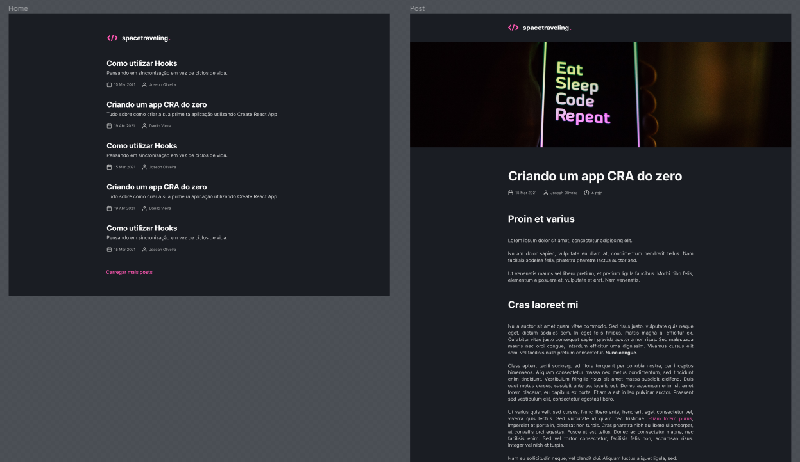
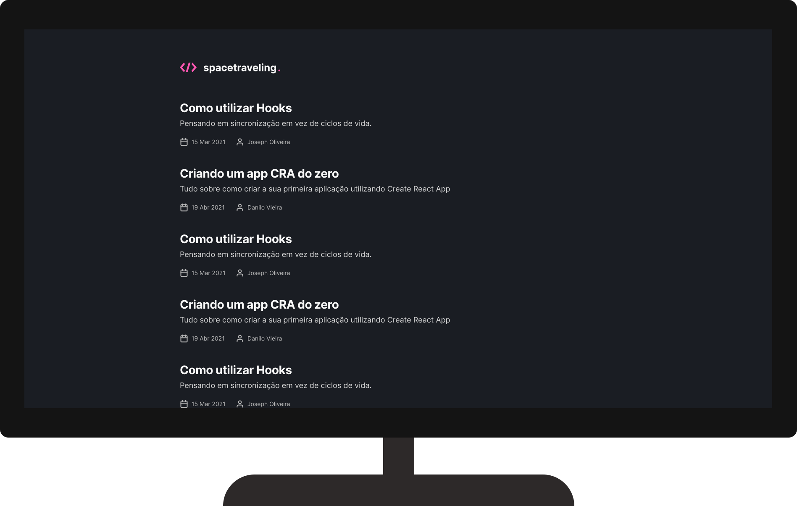

<h1 align="center">
   </>spacetraveling | Desafio Ignite - Módulo 3
</h1>

<br/>

## 💻 Projeto
 Neste desafio são demonstrados alguns conhecimentos adquiridos na trilha de ReactJS, esta aplicação foi recebida praticamente em branco e no decorrer do desenvolvimento foram implementadas as seguintes funcionalidades:

  - Estilizações global, comum e individuais;
  - Importação de fontes Google;
  - Paginação de posts;
  - Cálculo de tempo estimado de leitura do post;
  - Geração de páginas estáticas com os métodos `getStaticProps` e `getStaticPaths`;
  - Formatação de datas com `date-fns`;
  - Uso de ícones com `react-icons`;
  - Requisições HTTP com `fetch`;
  - Entre outros.


## 🔖 Layout
 O layout pode ser acessado através do Figma, basta [clicar aqui](https://www.figma.com/file/1LnzxwB7qK4oXgiCLuoD20/Desafios-M%C3%B3dulo-3---Ignite%2F-ReactJS?node-id=24601%3A122)

 <h1 align="center">
    
</h1>


 <h1 align="center">
    
</h1>

 ## 🚀 Tecnologias

- [NextJS](https://nodejs.org/en/)
- [ReactJS](https://reactjs.org)
- [Typescript](https://www.typescriptlang.org/)
- [Scss](https://sass-lang.com/)

### 📡 Ferramentas Complementares

- [Prismic](https://prismic.io/)
- [Date Fns](https://date-fns.org/)
- [Eslint](https://eslint.org/)

<br/>


## 🤔 Como posso interagir com projeto?

- Para instalar localmente, siga os passos abaixo:

<br/>

```sh
git clone https://github.com/ManuelMolina02/react-ignite-criando-um-projeto-do-zero.git
```

Após baixar o projeto, acesse o repositório via terminal e execute os seguintes comandos:

```sh
yarn install
yarn dev
```

<br/>
<br/>

Feito com 💜 por Manuel Molina 👋 Me contate através do [LinkedIn!](https://www.linkedin.com/in/manuel-angel-berger-molina-ba08b3174/)

